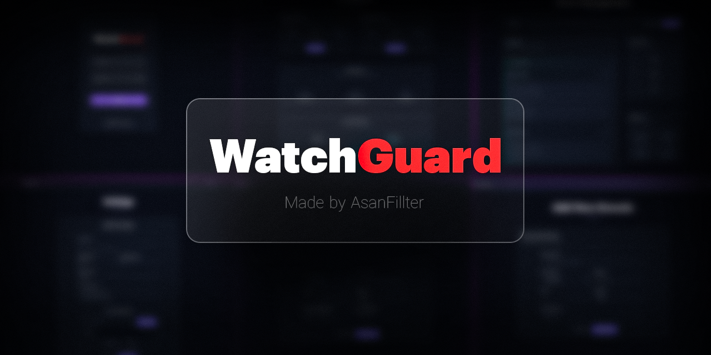
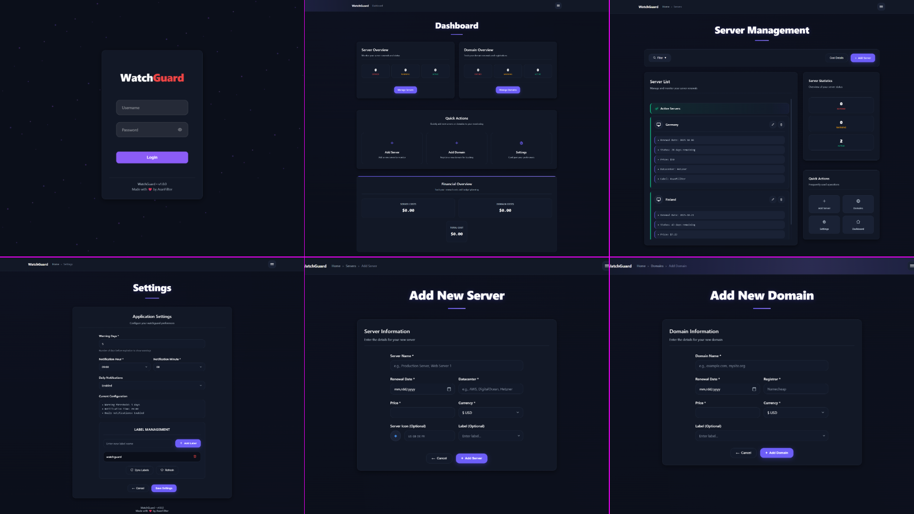

<div align="center">
  <h1>WatchGuard</h1>
  <p style="margin: 0;">Keep server & domain renewals under control — fast & simple</p>
  <div style="display:flex; gap:10px; justify-content:center; margin: 12px 0 14px;">
    
    
  </div>
</div>

<div align="center" style="margin-top:10px;">
  
</div>

<div align="center" style="margin-top:8px;">
  WatchGuard pairs a clean FastAPI web panel with a Telegram bot to help you track server and domain expirations.
</div>

## Key capabilities
- **At-a-glance expirations**: see upcoming renewals with custom warning windows
- **Labels & filters**: expired / warning / active, plus quick cost summaries (USD/EUR)
- **Telegram bot**: on-the-go checks and daily reminders
- **Simple install**: one-command installer on Linux; no external database

**Bot commands**: `/start`, `/servers`, `/domains`, `/settings`, `/dashboard`, `/notify`

## WatchGuard Installation
```bash
curl -L -o watchguard.tar.gz https://codeload.github.com/AsanFillter/watchguard/tar.gz/refs/heads/main
mkdir -p watchguard && tar -xzf watchguard.tar.gz -C watchguard --strip-components=1
rm -f watchguard.tar.gz
cd watchguard
sudo bash watchguard_launcher.sh
```

Then from the installer:
1) Install Web Panel + Bot (or individually)  
2) Set admin credentials and panel port  
3) Provide Telegram Bot Token and numeric Chat IDs (comma-separated)  
4) Optionally enable HTTPS

### Access
- **Panel**: http(s)://<server-ip-or-domain>:<port>  
- **Bot**: open your bot in Telegram and send `/start`

## Data & config
- `servers.json`, `domains.json` — items
- `labels.json` — labels
- `settings.json` — app settings (warning days, time, labels, ssl paths)
- `config.json` — Telegram token & chat IDs
- `auth_config.json` — admin credentials

## Screenshots
<div align="center">
  
</div>

## Support
- **Telegram Channel**: [@AsanFillter](https://t.me/AsanFillter)  
- **Telegram Group**: [@AsanFillter_Group](https://t.me/asanfillter_group)

If you like this project, don't forget to star the repo:

<div align="center" style="margin-top:10px;">
  <a href="https://starchart.cc/AsanFillter/watchguard">
    
  </a>
</div>